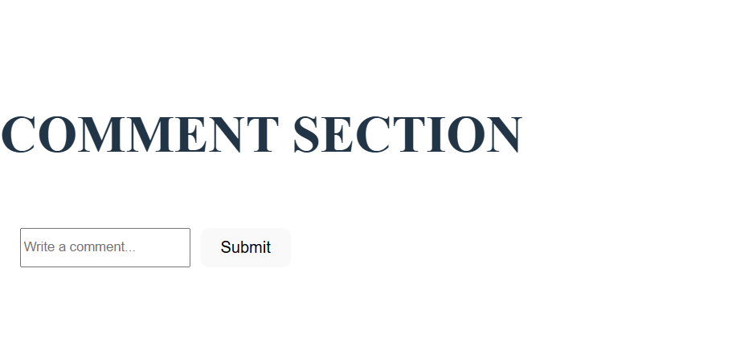
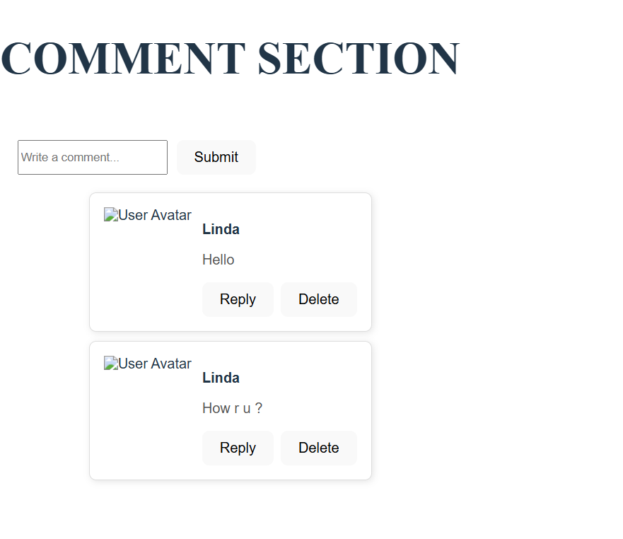

# Comment System Using Component and Props

To build a comment section, you'll need components for displaying comments, creating new comments, and potentially managing them. Here's a breakdown of common components and their roles: Core Components:CommentList (or Comments):This component is responsible for rendering a list of all comments, potentially with pagination or infinite scrolling for large comment threads. Comment:Represents a single comment, displaying the author, content, timestamp, and any actions (like likes, replies). CommentForm:Allows users to submit new comments, typically including a text input field and a submit button. ReplyForm:If implementing nested replies, this component would be used to submit a reply to a specific comment. UserAvatar:Displays the user's profile picture, which can be a separate component or part of the Comment component. Optional Components:CommentActions: A component to handle actions like liking, replying, or deleting a comment. SortOptions: Allows users to sort comments by date, popularity, or other criteria. 

CommentThread: If implementing nested replies, this component could be used to render a single thread of comments, including parent comments and their replies. 

## OUTPUT

